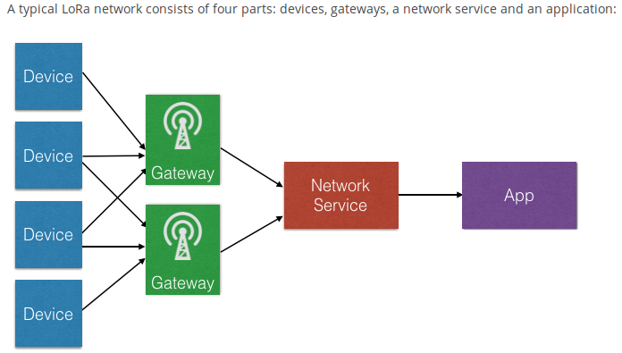
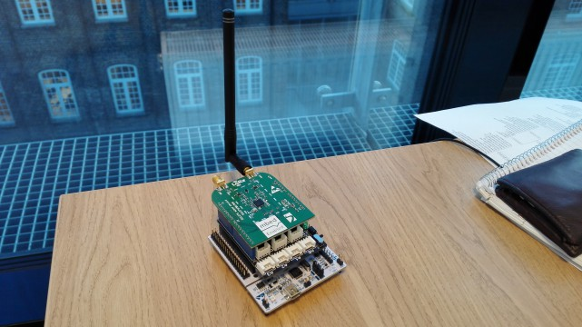

<head>
</head>

# Hands-on LoRa workshop

**Date:** Monday, 23. May 2016 12-14, at [DIGS](http://www.digs.no/)

**Organizers:** embedded.trd, Wireless Trondheim and [CTT (Carbon Track and Trace)](http://www.carbontrackandtrace.com/)

The purpose of this 2-hour workshop is to get hands-on experience
with using the LoRa network in Trondheim. LoRa is a new
radio standard for connecting things to the internet. Its
features are long range and low battery. So it is useful to
power the internet of things.

You need to bring your laptop.

We bring the hardware:

* 10x [Nucleo-L152RE](https://developer.mbed.org/platforms/ST-Nucleo-L152RE/)
* 10x [Semtech SX1276MB1xAS](https://developer.mbed.org/components/SX1276MB1xAS/)
* 10x [Seed Grove Shield V2](https://developer.mbed.org/components/Seeed-Grove-Shield-V2/)

# 1. Acquire knowledge about LoRa

Skim the attached [technical overview of LoRa and LoRaWAN](pdfs/LoRaWAN101.pdf)

If you are sufficiently adventurous you can also skim the
[LoRaWAN specification](pdfs/LoRaWAN Specification 1R0.pdf).

# 2. Create an account at the ARM embed platform

**NOTE: I had to whitelist the webpage in my ad-blocker to avoid visual bugs.**

To produce binaries for hardware, we use the
[ARM embed platform](https://developer.mbed.org/).

It is a convenient web-based platform. First you write your C code in the browser and
it is compiled on ARM's servers. Next the binary is downloaded to
your local storage medium. Last you transfer it to a device.

Add the
[microcontroller "platform"](https://developer.mbed.org/platforms/ST-Nucleo-L152RE/)
to your mbed compiler.

After you have created an account, go to the compiler and create a new program.
Select the Nucleo-L152RE platform.

# 3. Produce the binary

First create a new program. Choose "Empty Program" in the templates dropdown.

Second rightclick on your program and click "import library". Search for
"mbed". Import the one where author is
["mbed\_official".](http://mbed.org/users/mbed_official/code/mbed/).

Third, create a New File "main.cpp". Fill it with this content:

	#include "mbed.h"
	
	int main() {
	
	    while(1) {
	        printf("hello world \n");
	        wait(0.5); // 500 ms
	    }
	}

Last, hit the Compile button.

If the compilation is successful, a binary should be downloaded to your local storage.

# 4. Transfer the binary to the microcontroller

This is also known as _flashing_ the device. Attach the microcontroller to your laptop
via USB cable. It should appear as a storage device and will probably be mounted
onto your filesystem automatically.

Transfer the binary by moving it:

	mv downloads/lora-workshop-test_NUCLEO_L152RE.bin /media/d/NODE_L152RE/

This will actually flash the device.

The USB port also exposes a serial port. Its purpose is communication between the
microcontroller and your laptop. Inspect the serial output with (Linux):

	minicom -D /dev/ttyACM0 -b 9600

It should print out "hello world" each second.

# 5. Hello LoRa!

Now we are gonna attach the Seed Grove Shield V2 and Semtech SX1276MB1xAS onto
the Nucleo. Like this:

Also attach the radio antenna to ANT_\HF.

To compile a lora application we need to import two libraries:

* [Semtech/LMiC](https://developer.mbed.org/teams/Semtech/code/LMiC/)
* [Semtech/SX1276Lib](https://developer.mbed.org/teams/Semtech/code/SX1276Lib/)

[IBM LoRaWAN in C (LMiC)](http://www.research.ibm.com/labs/zurich/ics/lrsc/lmic.html)
is IBM's implementation of the LoRaWAN protocol. Its API can be found in the 
[user guide](pdfs/LMiC-v1.5.pdf).

Semtech/SX1276Lib is a driver for the SX1276 RF transceiver.

After importing those two libraries, you could try to compile. You will discover some compile errors:

    Error: Undefined symbol hal\_failed() (referred from lmic.cpp.NUCLEO\_L152RE.o).
    Error: Undefined symbol hal\_checkTimer(unsigned) (referred from oslmic.cpp.NUCLEO_L152RE.o).
    Error: Undefined symbol hal\_enableIRQs() (referred from oslmic.cpp.NUCLEO_L152RE.o).
    Error: Undefined symbol hal\_disableIRQs() (referred from oslmic.cpp.NUCLEO_L152RE.o).
    Error: Undefined symbol hal\_init() (referred from oslmic.cpp.NUCLEO_L152RE.o).
    Error: Undefined symbol hal\_sleep() (referred from oslmic.cpp.NUCLEO_L152RE.o).
    Error: Undefined symbol hal\_ticks() (referred from oslmic.cpp.NUCLEO_L152RE.o).
    Error: Undefined symbol hal\_waitUntil(unsigned) (referred from radio.cpp.NUCLEO_L152RE.o).

The LMiC library is separated into a large portion of portable code and a small platform-specific part.
By implementing the functions of this hardware abstraction layer with the specified semantics, the
library can be easily ported to new hardware platforms.

For the Nucleo-L152RE, create a file "hal.cpp" with the following contents:

## hal.cpp

	#include "mbed.h"
	#include "lmic.h"
	#include "mbed_debug.h"
	 
	#if !USE_SMTC_RADIO_DRIVER
	 
	extern void radio_irq_handler( u1_t dio );
	 
	static DigitalOut nss( D10 );
	static SPI spi( D11, D12, D13 ); // ( mosi, miso, sclk )
	 
	static DigitalInOut rst( A0 );
	static DigitalOut rxtx( A4 );
	 
	static InterruptIn dio0( D2 );
	static InterruptIn dio1( D3 );
	static InterruptIn dio2( D4 ); 
	 
	static void dio0Irq( void ) {
	    radio_irq_handler( 0 );
	}
	 
	static void dio1Irq( void ) {
	    radio_irq_handler( 1 );
	}
	 
	static void dio2Irq( void ) {
	    radio_irq_handler( 2 );
	}
	 
	#endif
	 
	static u1_t irqlevel = 0;
	static u4_t ticks = 0;
	 
	static Timer timer;
	static Ticker ticker;
	 
	static void reset_timer( void ) {
	    ticks += timer.read_us( ) >> 6;
	    timer.reset( );
	}
	 
	void hal_init( void ) {
	     __disable_irq( );
	     irqlevel = 0;
	 
	#if !USE_SMTC_RADIO_DRIVER
	    // configure input lines
	    dio0.mode( PullDown );
	    dio0.rise( dio0Irq );
	    dio0.enable_irq( );
	    dio1.mode( PullDown );   
	    dio1.rise( dio1Irq );
	    dio1.enable_irq( );
	    dio2.mode( PullDown );
	    dio2.rise( dio2Irq );
	    dio2.enable_irq( );
	    // configure reset line
	    rst.input( );
	    // configure spi
	    spi.frequency( 8000000 );
	    spi.format( 8, 0 );
	    nss = 1;
	#endif
	    // configure timer
	    timer.start( );
	    ticker.attach_us( reset_timer, 10000000 ); // reset timer every 10sec
	     __enable_irq( );
	}
	 
	#if !USE_SMTC_RADIO_DRIVER
	 
	void hal_pin_rxtx( u1_t val ) {
	    rxtx = !val;
	}
	 
	void hal_pin_nss( u1_t val ) {
	    nss = val;
	}
	 
	void hal_pin_rst( u1_t val ) {
	    if( val == 0 || val == 1 )
	    { // drive pin
	        rst.output( );
	        rst = val;
	    } 
	    else
	    { // keep pin floating
	        rst.input( );
	    }
	}
	 
	u1_t hal_spi( u1_t out ) {
	    return spi.write( out );
	}
	 
	#endif
	 
	void hal_disableIRQs( void ) {
	    __disable_irq( );
	    irqlevel++;
	}
	 
	void hal_enableIRQs( void ) {
	    if( --irqlevel == 0 )
	    {
	        __enable_irq( );
	    }
	}
	 
	void hal_sleep( void ) {
	    // NOP
	}
	 
	u4_t hal_ticks( void ) {
	    hal_disableIRQs( );
	    int t = ticks + ( timer.read_us( ) >> 6 );
	    hal_enableIRQs( );
	    return t;
	}
	 
	static u2_t deltaticks( u4_t time ) {
	    u4_t t = hal_ticks( );
	    s4_t d = time - t;
	    if( d <= 0 ) {
	        return 0;    // in the past
	    }
	    if( ( d >> 16 ) != 0 ) {
	        return 0xFFFF; // far ahead
	    }
	    return ( u2_t )d;
	}
	 
	void hal_waitUntil( u4_t time ) {
	    while( deltaticks( time ) != 0 ); // busy wait until timestamp is reached
	}
	 
	u1_t hal_checkTimer( u4_t time ) {
	    return ( deltaticks( time ) < 2 );
	}
	 
	void hal_failed( void ) {
	    while( 1 );
	}

Now try compiling again. It should compile.

## main.cpp

Now let's improve main.cpp. It looks confusing at first if you are unfamiliar with LMiC.

For node managment we are going to use
[The Things Network's `ttnctl`](https://staging.thethingsnetwork.org/wiki/Backend/ttnctl/QuickStart) tool.
Follow the instructions on that wiki page.

We are going to configure the device with
[Over-the-Air-Activation (OTAA)](https://staging.thethingsnetwork.org/wiki/Backend/ttnctl/QuickStart#quick-start-guide-for-ttnctl_device-management).

Here is a sample code:

	#include "mbed.h"
	
	#include "lmic.h"
	#include "debug.h"
	
	#define OVER_THE_AIR_ACTIVATION                     1
	
	#define APP_TX_DUTYCYCLE                            5000 // 5 [s] value in ms
	#define APP_TX_DUTYCYCLE_RND                        1000 // 1 [s] value in ms
	#define LORAWAN_ADR_ON                              1
	#define LORAWAN_CONFIRMED_MSG_ON                    1
	#define LORAWAN_APP_PORT                            15
	#define LORAWAN_APP_DATA_SIZE                       10
	
	static const uint8_t AppEui[8] =
	{
	    0x9F, 0x01, 0x00, 0xD0, 0x7E, 0xD5, 0xB3, 0x70
	};
	
	static const u1_t DevEui[8] =
	{
	    0x08, 0x07, 0x06, 0x05, 0x04, 0x03, 0x02, 0x01
	};
	
	// device-specific AES key (derived from device EUI)
	static const uint8_t DevKey[16] = 
	{
	    0xBD, 0x51, 0x15, 0x4C, 0xF2, 0xB5, 0xD8, 0x3F, 0xE5, 0xF4, 0xBA, 0x09, 0xFE, 0x14, 0x85, 0x11
	};
	
	// LEDs and Frame jobs
	osjob_t rxLedJob;
	osjob_t txLedJob;
	osjob_t sendFrameJob;
	
	// LED state
	static bool AppLedStateOn = false;
	
	int32_t randr( int32_t min, int32_t max )
	{
	    return ( int32_t )rand( ) % ( max - min + 1 ) + min;
	}
	
	void os_getArtEui( uint8_t *buf )
	{
	    memcpy( buf, AppEui, 8 );
	}
	
	void os_getDevEui( uint8_t *buf )
	{
	    memcpy( buf, DevEui, 8 );
	}
	
	void os_getDevKey( uint8_t *buf )
	{
	    memcpy( buf, DevKey, 16 );
	}
	
	static void onRxLed( osjob_t* j )
	{
	    debug_val("LED2 = ", 0 );
	}
	
	static void onTxLed( osjob_t* j )
	{
	    debug_val("LED1 = ", 0 );
	}
	
	static void prepareTxFrame( void )
	{
	    LMIC.frame[0] = 'H';
	    LMIC.frame[1] = 'e';
	    LMIC.frame[2] = 'i';
	    LMIC.frame[3] = ' ';
	    LMIC.frame[4] = 'v';
	    LMIC.frame[5] = 'e';
	    LMIC.frame[6] = 'r';
	    LMIC.frame[7] = 'd';
	    LMIC.frame[8] = 'e';
	    LMIC.frame[9] = 'n';
	}
	
	void processRxFrame( void )
	{
	    switch( LMIC.frame[LMIC.dataBeg - 1] ) // Check Rx port number
	    {
	        case 1: // The application LED can be controlled on port 1 or 2
	        case 2:
	            if( LMIC.dataLen == 1 )
	            {
	                AppLedStateOn = LMIC.frame[LMIC.dataBeg] & 0x01;
	                debug_val( "LED3 = ", AppLedStateOn );
	            }
	            break;
	        default:
	            break;
	    }
	}
	
	static void onSendFrame( osjob_t* j )
	{
	    prepareTxFrame( );
	    LMIC_setTxData2( LORAWAN_APP_PORT, LMIC.frame, LORAWAN_APP_DATA_SIZE, LORAWAN_CONFIRMED_MSG_ON );
	
	    // Blink Tx LED
	    debug_val( "LED1 = ", 1 );
	    os_setTimedCallback( &txLedJob, os_getTime( ) + ms2osticks( 25 ), onTxLed );
	}
	
	// Initialization job
	static void onInit( osjob_t* j )
	{
	    // reset MAC state
	    LMIC_reset( );
	    LMIC_setAdrMode( LORAWAN_ADR_ON );
	#if defined(CFG_eu868)
	    LMIC_setDrTxpow( DR_SF12, 14 );
	#elif defined(CFG_us915)    
	    LMIC_setDrTxpow( DR_SF10, 14 );
	#endif
	
	    // start joining
	#if( OVER_THE_AIR_ACTIVATION != 0 )
	    LMIC_startJoining( );
	#else
	    LMIC_setSession( LORAWAN_NET_ID, LORAWAN_DEV_ADDR, NwkSKey, ArtSKey );
	    onSendFrame( NULL );
	#endif
	    // init done - onEvent( ) callback will be invoked...
	}
	
	int main( void )
	{
	    osjob_t initjob;
	
	    // initialize runtime env
	    os_init( );
	    // setup initial job
	    os_setCallback( &initjob, onInit );
	    // execute scheduled jobs and events
	    os_runloop( );
	    // (not reached)
	}
	
	void onEvent( ev_t ev )
	{
	    bool txOn = false;
	    debug_event( ev );
	
	    switch( ev ) 
	    {
	    // network joined, session established
	    case EV_JOINED:
	        debug_val( "Net ID = ", LMIC.netid );
	        txOn = true;
	        break;
	    // scheduled data sent (optionally data received)
	    case EV_TXCOMPLETE:
	        debug_val( "Datarate = ", LMIC.datarate );
	        // Check if we have a downlink on either Rx1 or Rx2 windows
	        if( ( LMIC.txrxFlags & ( TXRX_DNW1 | TXRX_DNW2 ) ) != 0 )
	        {
	            debug_val( "LED2 = ", 1 );
	            os_setTimedCallback( &rxLedJob, os_getTime( ) + ms2osticks( 25 ), onRxLed );
	
	            if( LMIC.dataLen != 0 )
	            { // data received in rx slot after tx
	                debug_buf( LMIC.frame + LMIC.dataBeg, LMIC.dataLen );
	                processRxFrame( );
	            }
	        }
	        txOn = true;
	        break;
	    default:
	        break;
	    }
	    if( txOn == true )
	    {
	        //Sends frame every APP_TX_DUTYCYCLE +/- APP_TX_DUTYCYCLE_RND random time (if not duty cycle limited)
	        os_setTimedCallback( &sendFrameJob,
	                             os_getTime( ) + ms2osticks( APP_TX_DUTYCYCLE + randr( -APP_TX_DUTYCYCLE_RND, APP_TX_DUTYCYCLE_RND ) ),
	                             onSendFrame );
	        
	        ////Sends frame as soon as possible (duty cylce limitations)
	        //onSendFrame( NULL );
	    }
	}

**NOTE:** The AppEUI and DevEUI need to be reversed from the printout with `ttnctl` due to endianness.

# 6. Did our data arrive?

Inspect the data using a cli MQTT client:

	mosquitto_sub -h staging.thethingsnetwork.org -P "hki96WIXS1oMnj0D8109A/ug791ywNuQemOGZfoqpRU=" -u 70B3D57ED000019F -t "+/devices/#"

`-P` is the access key and -u is the AppEui.
